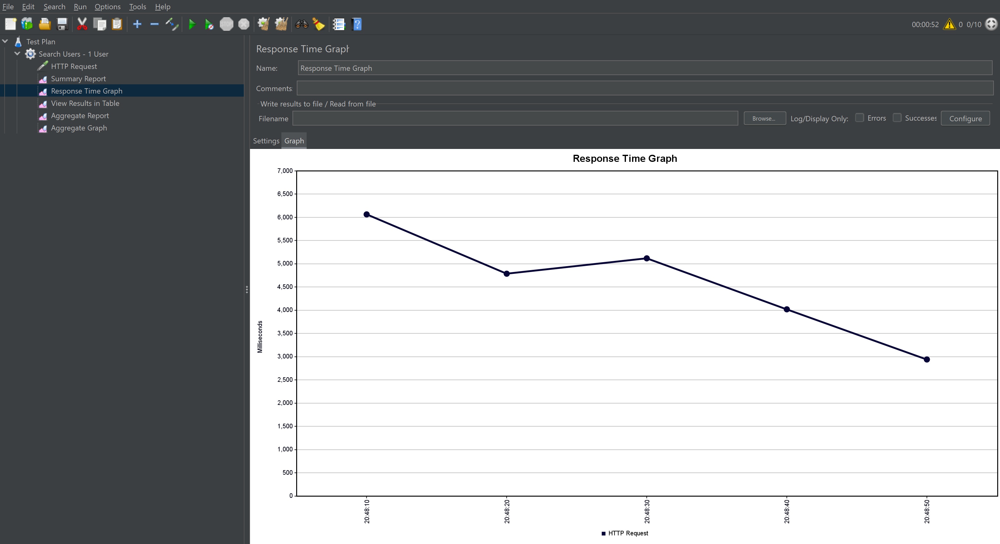
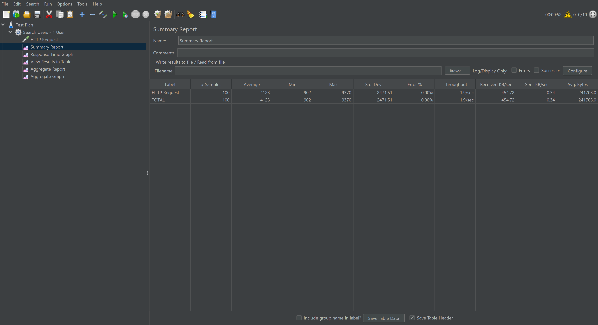
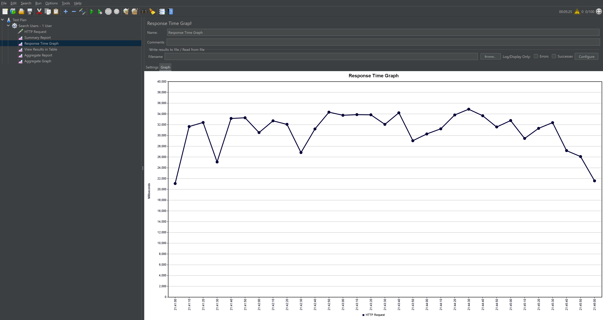
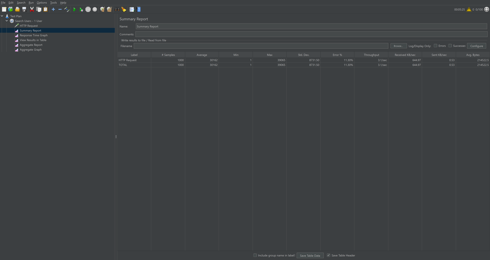
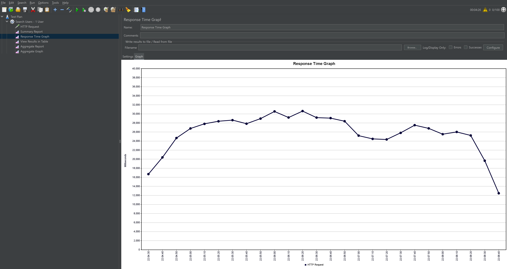
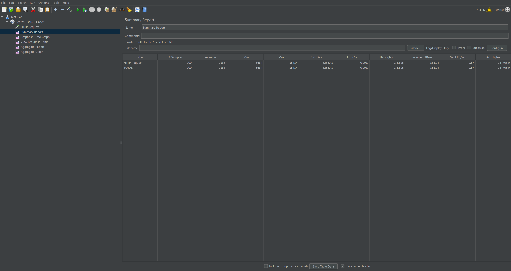
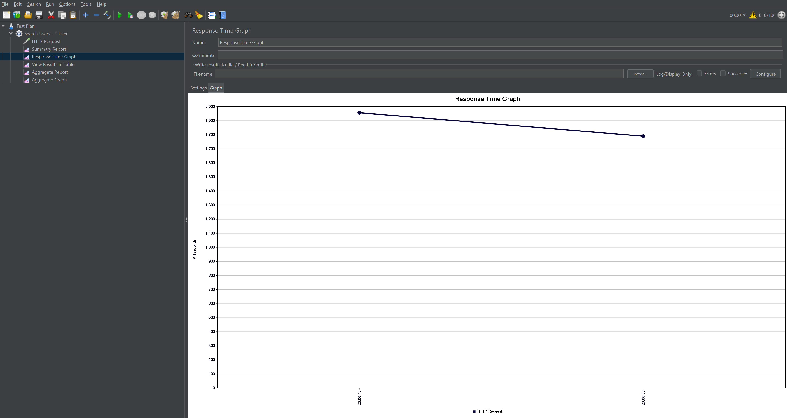
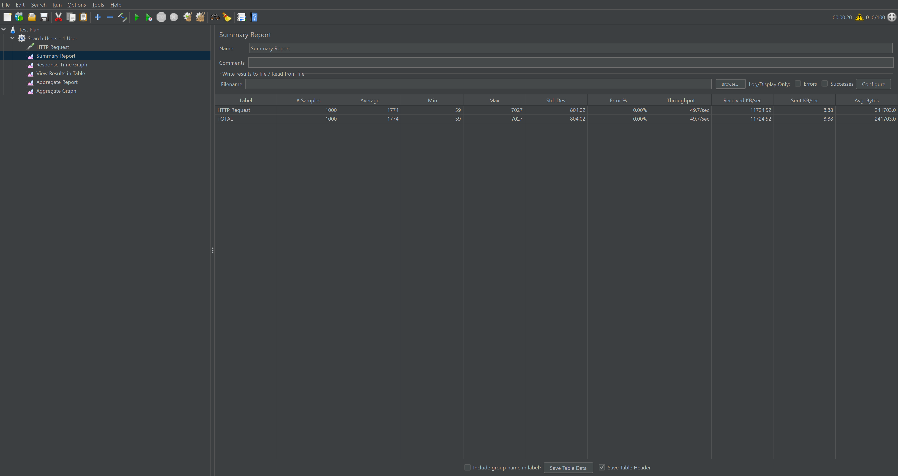

# HW 2 Нагрузочное тестирование и индексы

## Генерация данных
Запустить скрипт social-network\scripts\fill_test_data.py

## Графики до индекса

*Рисунок 1: График времени отклика (latency) до создания индекса - 10 одновременных пользователей по 10 запросов каждый*

Среднее время отклика: 4123ms

*Рисунок 2: Таблица пропускной способности (throughput) до создания индекса - 10 одновременных пользователей по 10 запросов каждый*

Пропускная способность: 1.9 запросов в сек

*Рисунок 3: График времени отклика (latency) до создания индекса - 100 одновременных пользователей по 10 запросов каждый*

Среднее время отклика 30162ms

*Рисунок 4: Таблица пропускной способности (throughput) до создания индекса - 100 одновременных пользователей по 10 запросов каждый*

Пропускная способность - 3.1 запросов в сек

Количество запросов с ошибками увеличилось до 11% (Причина - connection timed out)

Посмотрев логи, увидел, что не хватило соединений в pgpool (5), увеличил до 20 и прогнал еще раз

*Рисунок 5: График времени отклика (latency) до создания индекса - 100 одновременных пользователей по 10 запросов каждый pgpool = 20*

Среднее время отклика 25367ms

*Рисунок 6: Таблица пропускной способности (throughput) до создания индекса - 100 одновременных пользователей по 10 запросов каждый pgpool = 20*

Пропускная способность - 3.8 запросов в сек

## Графики после добавления индекса

*Рисунок 7: График времени отклика (latency) после создания индекса - 100 одновременных пользователей по 10 запросов каждый pgpool = 20*

Среднее время отклика 1774ms

*Рисунок 8: Таблица пропускной способности (throughput) после создания индекса - 100 одновременных пользователей по 10 запросов каждый pgpool = 20*

Пропускная способность - 49.7 запросов в сек

## Запрос добавления индекса

CREATE INDEX idx_users_search_lower ON users 
(lower(first_name) varchar_pattern_ops, lower(second_name) varchar_pattern_ops);

## Explain запросов после индекса

explain
SELECT id, first_name, second_name, birthdate::date as birthdate, biography, city
FROM users
WHERE lower(first_name) LIKE lower('нау') || '%' and lower(second_name) LIKE lower('кудр') || '%'
order by id

Sort  (cost=253.39..253.47 rows=31 width=183)
  Sort Key: id
  ->  Index Scan using idx_users_search_lower on users  (cost=0.43..252.62 rows=31 width=183)
        Index Cond: ((lower((first_name)::text) ~>=~ 'нау'::text) AND (lower((first_name)::text) ~<~ 'наф'::text) AND (lower((second_name)::text) ~>=~ 'кудр'::text) AND (lower((second_name)::text) ~<~ 'кудс'::text))
        Filter: ((lower((first_name)::text) ~~ 'нау%'::text) AND (lower((second_name)::text) ~~ 'кудр%'::text))

## Объяснение почему индекс именно такой
Выбрал функциональный индекс по двум полям (так как регистронезависимый поиск - индекс по приведным к нижнему регистру полям)

varchar_pattern_ops - Оптимизирует индекс для операций LIKE 'prefix%', используя побайтовое сравнение вместо локализованной сортировки

## Результат оптимизации:
Сравним показатели с графиков для 100 одновременных запросов

<b>До индекса</b>: 

Parallel Seq Scan (cost=55,031) - полное сканирование таблицы

Время отклика: 25 секунд

Пропускная способность: 4 запроса в секунду

<b>После добавления индекса</b>: 

Index Scan (cost=253) - улучшение в 220 раз

Время отклика: менее 2 секунд

Пропускная способность: 50 запросов в секунду