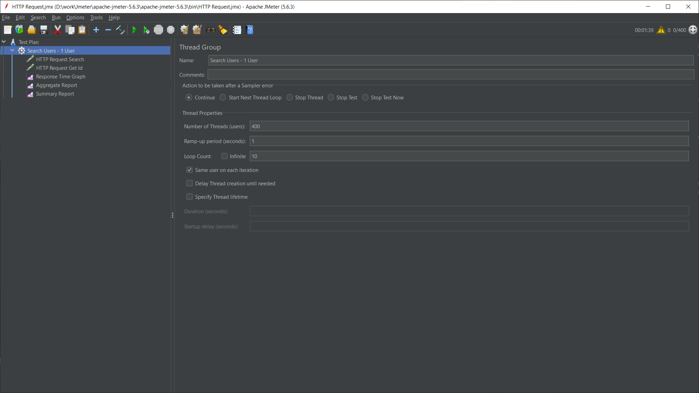
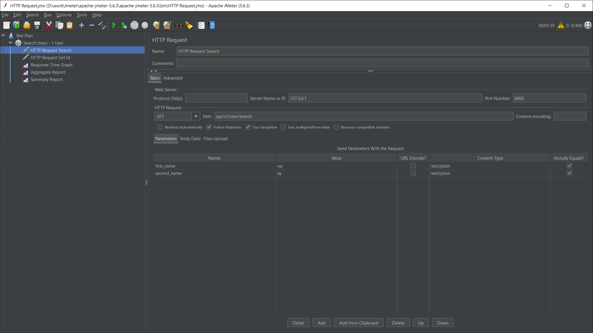
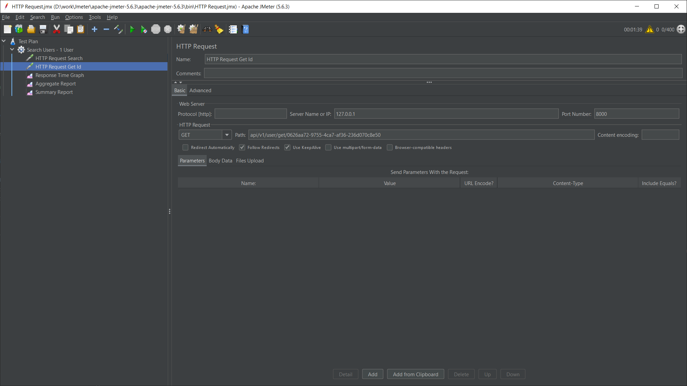
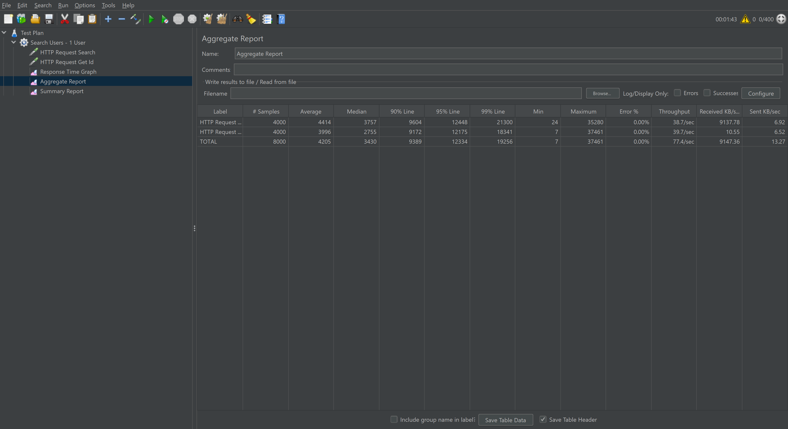

# HW 3 Репликация

1 План Нагрузочного тестирования

*Рисунок 1: План нагрузочного тестирования

*Рисунок 2: HTTP запрос search

*Рисунок 3: HTTP запрос get

*Рисунок 4: Результат измерений до репликации

*Рисунок 5: Результат измерений с 2 slave 

<b>Без репликации</b>

Пропускная способность - 79.1 запросов в сек

Среднее время отклика 4682ms

<b>С репликацией</b>

Пропускная способность - 77.4 запросов в сек

Среднее время отклика 4205ms

В целом с репликацией время отклика незначительно уменьшилось, а пропускная способность понизилась

<b>Настройка репликации</b>

1 - Добавлены 2 контейнера db-slave1 и db-slave2

 docker-compose.yml

2 - Изменения в конфигах master-db 

 social-network\master-db-config

3 - Скрипт настройки репликации 

social-network\setup-replication.bat

<b>Перевод запросов чтения на слейвы</b>

1 - Добавил класс, который упралвяет созданием соединений с нужной БД(чтение - запись) 

social-network\app\core\db_manager.py

2 - Перевел запросы чтения на реплики

<b>Проведен эксперимент по потере и непотере транзакций при аварийной остановке master.</b>

1 - Запустил скрипт вставки записей в мастер social-network\tests\test_bulk_insert.py

2 - погасил мастер

3 - по логам было вставлено 14 строк

4 - перевел слейв на мастер а второй слейв перключил на новый мастер

social-network\hw\hw3\promote_slave1.sql

social-network\hw\hw3\switch_slave2.sql

После этого проверил что количество вставленных строк в таблицу 14, то есть данные не были потеряны
